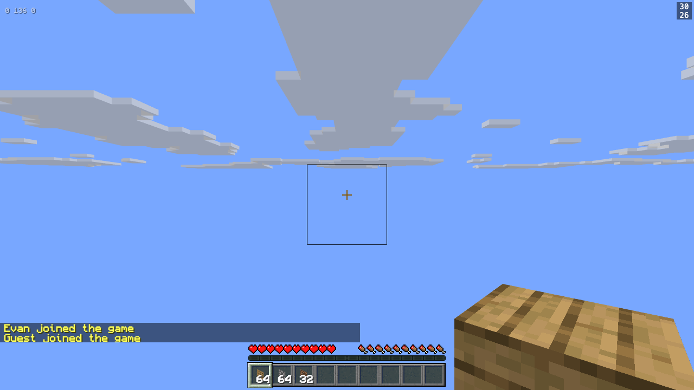
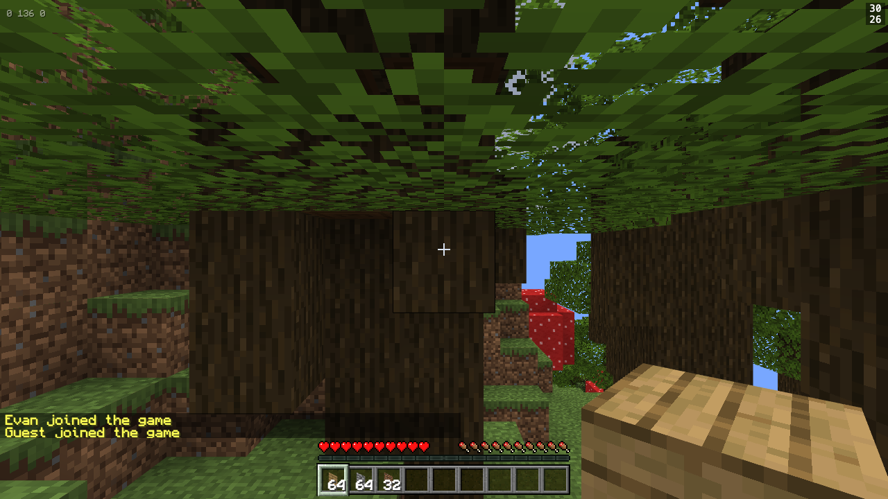

# Browsers

Survey and triage. The requirement is "this all needs to work in safari and
chrome", and until this pass nothing here had ever been run in anything but
Chromium — `test/playwright.config.js` had no `projects` block, so all 400-odd
tests were statements about one engine.

Measured against Playwright's WebKit 26.6 — the engine Safari 26.6 ships,
reporting itself as `Version/26.6 Safari/605.1.15` — on macOS arm64, against
the vite dev server. No `src/` file was changed to produce this document.

---

## The short version

**Safari works.** One thing was broken, it was the whole world, and it is fixed
as of `ac4d5d3`.

Everything else on the risk list came back clean on the first try: WebGL2,
array textures, top-level await, the `es2022` target, `image-rendering:
pixelated`, `appearance: none`, the GUI-pixel HUD scaling, `AudioContext`, and
the `performance.memory` fallback in the F3 screen. Safari is also **faster**
than the Chromium this suite has always run on.

This is what it looked like before the fix. Sky, clouds, HUD, chat, a player
standing on ground it can feel and cannot see:



And after, at the same spawn point — indistinguishable from Chromium:



---

## 1. The one that sank it, and why it was Safari and only Safari

### What you saw

A blue sky with clouds, a working HUD, a working crosshair, a working chat log,
and no world. `noa` up, player at `0, 136, 0`, `getBlock` answering correctly,
every physics test passing. A fully functioning game with the terrain layer
invisible, and 18 copies of this at boot:

```
FRAGMENT SHADER ERROR: 0:308: 'uAnimRemap' : undeclared identifier
Offending line [308] in fragment code:
  float noaMapped = uAnimRemap[noaLayer >> 2][noaLayer & 3];
```

Zero copies in Chromium.

### Why, precisely

`AnimatedTerrainPlugin.getUniforms()` used to return

```js
{ ubo: [{ name: 'uAnimRemap' }], fragment: 'uniform vec4 uAnimRemap[N];' }
```

`materialPluginManager.js:251` injects that `fragment` string by replacing the
literal token `#define ADDITIONAL_FRAGMENT_DECLARATION`. **That token exists in
exactly one place in Babylon 6:**

```
node_modules/@babylonjs/core/Shaders/ShadersInclude/defaultFragmentDeclaration.js
```

which is the **non-uniform-buffer** declaration include. The uniform-buffer
include next to it, `defaultUboDeclaration.js`, carries
`ADDITIONAL_UBO_DECLARATION` instead — and that one is filled only from `ubo`
entries that have a `size` and a `type`, which this one deliberately does not.

Which of the two includes a material compiles with is
`engine.supportsUniformBuffers`, i.e. `webGLVersion > 1 &&
!this.disableUniformBuffers`. And `disableUniformBuffers` is set from a
**user-agent table** in `thinEngine.js:499` — Babylon's own list of known
driver bugs. Chrome is on that list. Safari is not.

Measured three ways, not assumed:

| | `supportsUniformBuffers` | declaration injected | terrain |
|---|---|---|---|
| Chromium headless + swiftshader | `false` | yes | drew |
| Chromium headed, real Apple GPU | `false` | yes | drew |
| WebKit 26.6 | **`true`** | **no** | **gone** |

So the plugin only ever worked on the code path Chrome is forced onto by a
workaround for an unrelated Chrome bug, and Safari was the first engine to take
the path the code was written against.

### A correction worth keeping

`ac4d5d3` lands the right fix — the declaration moves to
`CUSTOM_FRAGMENT_DEFINITIONS`, which both paths inject — but its comment says
`ADDITIONAL_FRAGMENT_DECLARATION` "appears in NO shader in Babylon 6", citing

```
grep -l ADDITIONAL_FRAGMENT_DECLARATION @babylonjs/core/Shaders/*.js
```

That glob does not descend into `Shaders/ShadersInclude/`, which is where the
token lives. The conclusion the comment draws from it — that the uniform "was
never declared, in any shader, ever", and that animating water in Chrome was
therefore an illusion — is not what the engines do. Chromium logged **zero**
shader errors and rendered terrain correctly both before and after. The fix is
right and the reasoning under it is off by one directory, which matters only
because the real rule is the useful one to remember: **a plugin uniform
declared through `getUniforms().fragment` exists on the non-UBO path only, and
which path you get is decided by the browser's user-agent string.**

`CUSTOM_FRAGMENT_DEFINITIONS` is the correct home precisely because it is
path-independent. The same trap is still live for any future plugin that
reaches for `getUniforms().fragment`.

### Verified

Booted under WebKit on `ac4d5d3`: zero shader errors,
`supportsUniformBuffers` still `true`, `game.terrainAnim.layerOf('water_still')`
returning a live remapped layer, and the screenshot above.

---

## 2. Everything else on the risk list, all clean

Worth recording as negatives, because several are the ones you would have bet
against.

**WebGL2 and array textures — the big one, and it is a non-issue.** Safari
reports `WebGL 2.0` on `Apple GPU`, `MAX_ARRAY_TEXTURE_LAYERS` of **2048**
against a spec floor of 256 (the atlas caps pages at 192), `MAX_TEXTURE_SIZE`
16384, and compiles a hand-written `sampler2DArray` fragment shader with a
runtime layer index clean, info log empty. The five-page paged atlas was never
in danger. The only thing wrong with the terrain shader was one missing
declaration line.

**Top-level await and the `es2022` target.** `src/main.js`'s boot gate works —
`window.game` is only reachable through the await. `Object.hasOwn`,
`Array.prototype.at`, error `cause`, and private/static class fields are all
present. `vite.config.js` needs no change.

**`performance.memory`.** Absent in Safari, as expected. `src/debugScreen.js`
claimed it omits the `Mem:` line rather than printing zeros; that claim had
never been run in a browser without the API, which is the only place it could
be wrong. It holds — F3 in Safari prints the whole screen with no `Mem:` line,
Chromium prints `Mem: 4% 133/3586MB`. The browser line is already correct too:
it reads `Safari: 26.6`, because `debugScreen.js:320` falls back to the
`Version/` UA token when the Chromium-only `userAgentData` is missing.

**CSS.** 637 elements compute `image-rendering: pixelated` and 749 compute
`appearance: none` — identical counts in both engines, and the HUD crops in the
suite land on the same coordinates, so the GUI-pixel scaling agrees too.

**Web Audio.** `window.AudioContext` is present unprefixed, so the
`window.AudioContext || window.webkitAudioContext` in `src/sounds.js:591` is
belt-and-braces rather than load-bearing. `game.sounds.state` reads `'off'`
before a gesture in both engines, and the whole of `12-sounds.spec.js` passes
under WebKit. **Half-tested, though**: headless has no real user activation, so
Safari's stricter resume-after-suspend rule is not exercised here. See
section 5.

**Speed.** Safari is the fast one. WebKit renders the spawn frame at ~30 fps
against Chromium-under-swiftshader's ~2, boots in ~1.2 s against ~6.6 s, and
runs the suite in 13 minutes against 18. That is a comparison against a CPU
rasteriser, not a GPU — but it does mean no WebKit failure below is a timeout
wearing a disguise.

---

## 3. Pointer lock: not reproduced, and it cannot be from here

`docs/REPORTED.md` #4 — cursor stays visible after closing the Escape menu, not
reproducible in Chromium — was the bug this pass was most likely to close.
**It did not reproduce, and no headless harness can make it.**

Playwright never grants pointer lock, in either engine, headless or headed. The
request is refused before anything worth testing is reached:

```
WebKit:   WrongDocumentError: Pointer lock requires the window to have focus.
Chromium: WrongDocumentError: The root document of this element is not valid for pointer lock.
```

An automated window does not hold OS focus, so user activation, the post-Escape
cooldown and every difference between the two engines all sit behind a gate
that never opens. `test/helpers/errors.js` already filters this entire class of
message as headless noise, which is the right call and also exactly why the
coverage hole went unnoticed.

Two things did fall out of looking:

**`37-menu-cursor.spec.js` passes under WebKit, and that is not evidence.** It
cannot fail: with no lock ever granted it is asserting on CSS classes and
`inputLock` state, not on a cursor. The reported bug lives entirely in the gap
that spec cannot reach, in both engines.

**A real hazard, engine-independent, two lines to close.**
`micro-game-shell.js:209-212` handles a *rejected promise* from
`requestPointerLock` and not a *synchronous throw*:

```js
var res = el.requestPointerLock()
if (res && res.catch) res.catch(err => { /* handled in pointerlockerror */ })
```

Both engines throw synchronously in the no-focus case, so the path is real. If
Safari also throws synchronously in the post-Escape case — plausible, unproven
— the throw propagates up through `noa.container.setPointerLock` into
`requestLockPersistently` (`src/menu.js:55`), which calls it on line 60,
*before* `lockTimer = setInterval(...)` on line 62. The retry loop is then never
armed at all. Not "7 of 14 tries unspent" — zero tries. That matches the report
better than a lost race does.

Wrapping line 60 and the interval body in `try`/`catch` cannot make anything
worse and would make the loop survive a throwing first attempt on any engine.
Worth doing on suspicion.

**Closing it properly needs a human.** Open Safari on 5173, press Escape, click
Back to Game, say whether the cursor goes away. Five minutes, and the only way.

---

## 4. The suite

`test/playwright.config.js` now has two projects. Chromium is first and keeps
its `launchOptions`; the `GL_FLAGS` in `test/helpers/launch.js` are Chromium
command-line switches, and moving them out of the shared `use` block into the
chromium project is the change that makes WebKit launchable at all. WebKit
takes no flags — its headless WebGL goes through the system GPU path and needs
no CPU rasteriser bolted on.

```
npm test                          both engines
npm test -- --project=chromium    exactly what `npm test` used to do
npm test -- --project=webkit      the new one
```

`test/helpers/launch.js` also gained `NO_GL_FLAGS=1`, which drops the
swiftshader switches so Chromium runs on the real GPU. It is a local diagnostic
for one question — "does this test only pass because the frame rate is 2 fps?"
— and deliberately not a config project, since headless Chromium without those
flags has no rasteriser at all.

`test/43-browsers.spec.js` is new and engine-agnostic on purpose: no
`browserName` branches, no skips. A check that only runs on one engine is how
this gap got here. It pins six things — no shader fails to compile at boot;
WebGL2 array textures are deep enough; the animated atlas layers loaded; the
`Mem:` line appears exactly where `performance.memory` does; the `es2022`
features are real; the pixel-art CSS computes. **All six pass in both engines**
on `ac4d5d3`; four of the six failed under WebKit before it.

### Results

Three full runs, one worker, serial, 2026-09-15. Other agents were landing work
throughout -- two spec files and two `src/` fixes appeared between runs -- so
these are a snapshot on a moving branch, and the totals differ because the
suite grew under them.

| | passed | failed | total | wall |
|---|---|---|---|---|
| **WebKit**, before `ac4d5d3` | 392 | 25 | 417 | 13.3 min |
| **Chromium** (swiftshader) | 416 | 16 | 432 | 17.7 min |
| **WebKit**, after `ac4d5d3` | 426 | 6 | 432 | 12.4 min |

WebKit is the faster engine here by five minutes, because Chromium is
rasterising on the CPU.

### Triage, by owning file

Of WebKit's six remaining failures, **one is Safari's and five are not.** Every
one was checked against Chromium on the same commit rather than assumed, which
is the whole reason the original 25 account for cleanly:

| cause | count | where they went |
|---|---|---|
| the `uAnimRemap` shader and its cascade | 12 | fixed by `ac4d5d3` |
| a fluids regression, red in Chromium too | 8 | fixed by `f95fc3d` |
| `deviceScaleFactor: 2` from the device descriptor | 2 | fixed here |
| CDP, a Chromium-only test API | 1 | open, test's fault |
| vertical flight decay | 1 | **open, and the only real one** |
| furnace shift-click, landing mid-run | 1 | gone on re-run |

#### Fixed while this was being written -- `src/terrainAnimation.js`

Twelve were the shader and nothing else: `01-world:6`, `15-held-item:300`,
`29-first-person-arm:212`, `18-respawn-render:155` ("looking at sky through the
floor" -- the literal symptom), `28-underwater:162` (`terrain-textured-1 never
compiled`), and all six of `17-non-cube`'s slab and stair tests, whose rig is
built out of blocks that never got a material.

#### Fixed here -- `test/playwright.config.js`

`39-animated-textures:232`, "Image to composite must have same dimensions or
smaller". Mine, and a good illustration of the trap in adopting a second
engine: `devices['Desktop Safari']` carries `deviceScaleFactor: 2`, so every
screenshot crop came back at 2560x1440 and `sharp` refused to composite it into
a strip sized for 1280x720. Both projects now pin `deviceScaleFactor: 1`.
Anyone adding a third engine should look here first.

#### Not Safari -- failing in Chromium too, on the same commit

- **`36-face-shading.spec.js:193`**, "a real rendered wall has four matching
  side faces" (`noon 0.350 night 0.350` against a ceiling of `0.210`). Failed
  in the full Chromium run as well.
- **`39-animated-textures.spec.js:172`**, "frozen water changed between 0 and
  1". Same -- red in both engines.

Neither is a browser problem. Both belong to whoever owns face shading and the
animated textures.

#### Not Safari -- order-dependent, and it fooled me twice

**`44-portals.spec.js:332`** fails in the full WebKit run and **passes in both
engines when run alone**, 9/9 each.

This is the sharpest trap in the suite and it is worth stating plainly: several
specs depend on state earlier specs leave behind, so *neither* a full-suite
result *nor* a single-spec result is a valid control on its own. Running
`17-non-cube` and `30-water-entry` in isolation had me briefly convinced they
were broken everywhere; they pass in the full suite. `44-portals:332` is the
mirror image. Any cross-engine claim needs the *same* invocation on both
engines, and the rigs in those three files should be made self-contained before
this costs someone a day.

#### Genuinely WebKit-only -- the test's fault, `test/26-heart-animation.spec.js`

```
Error: browserContext.newCDPSession: CDP session is only available in Chromium
```

Line 209. The only Chromium-assuming line in 432 tests, which is a far better
result than a suite written against one engine had any right to. CDP drives the
frame capture. Either guard it with `test.skip(browserName !== 'chromium')` --
honest, and leaves the animation unchecked in Safari -- or replace the capture
with a `page.screenshot` loop, slower and portable. **Cost: one line, or twenty.**

#### Genuinely WebKit-only -- unexplained, `src/flight.js`

**`33-flight-decay.spec.js:106`**, "climbing stops five times quicker than
flying does". WebKit measures `1.633 b/s` against a ceiling of `0.225`,
reproducibly, in both full WebKit runs. It passes in Chromium under swiftshader
**and** on a real GPU, so unlike everything else in this document it is not a
frame-rate artefact and not shared. Vertical flight decay behaves differently
in Safari and nobody knows why yet.

**This is the only real Safari bug the suite found.** It is small, isolated,
and needs someone to instrument the decay loop under WebKit and watch what `dt`
it is actually fed.

#### An artefact collision -- `test/39-animated-textures.spec.js`

It writes its frame strips into `docs/water/`, so running the suite under
WebKit overwrites two of `docs/water.md`'s committed figures with pictures
taken in whatever state that engine was in. Give the output path a per-project
suffix, or gate the write on `browserName === 'chromium'`. It is the only place
where one engine's run corrupts another's committed artefacts, and it will
keep producing confusing diffs until it is fixed.

---

## 5. Honest read

Safari is working, and the distance from here to "working well" is shorter than
the distance already covered. The engine was never the obstacle: WebGL2 is
real, array textures are deep, shaders compile, top-level await works, the CSS
is fine, and it outruns the Chromium the suite has always used. One uniform
declaration stood between this project and a second browser, and it is gone.

What is left is not a list of Safari bugs. It is a measurement gap. **A
headless browser cannot hold pointer lock and cannot hand a page real user
activation**, so mouse-look, the Escape menu's cursor handover, and the first
sound after a click — the three things a player meets in the first ten seconds
— are all on the far side of a line this suite cannot cross, in either engine.
Adding WebKit proved the renderer. It did not, and structurally cannot, prove
the feel.

The next honest step is not more automation. It is ten minutes in a real Safari
window with `docs/REPORTED.md` #4 open.
