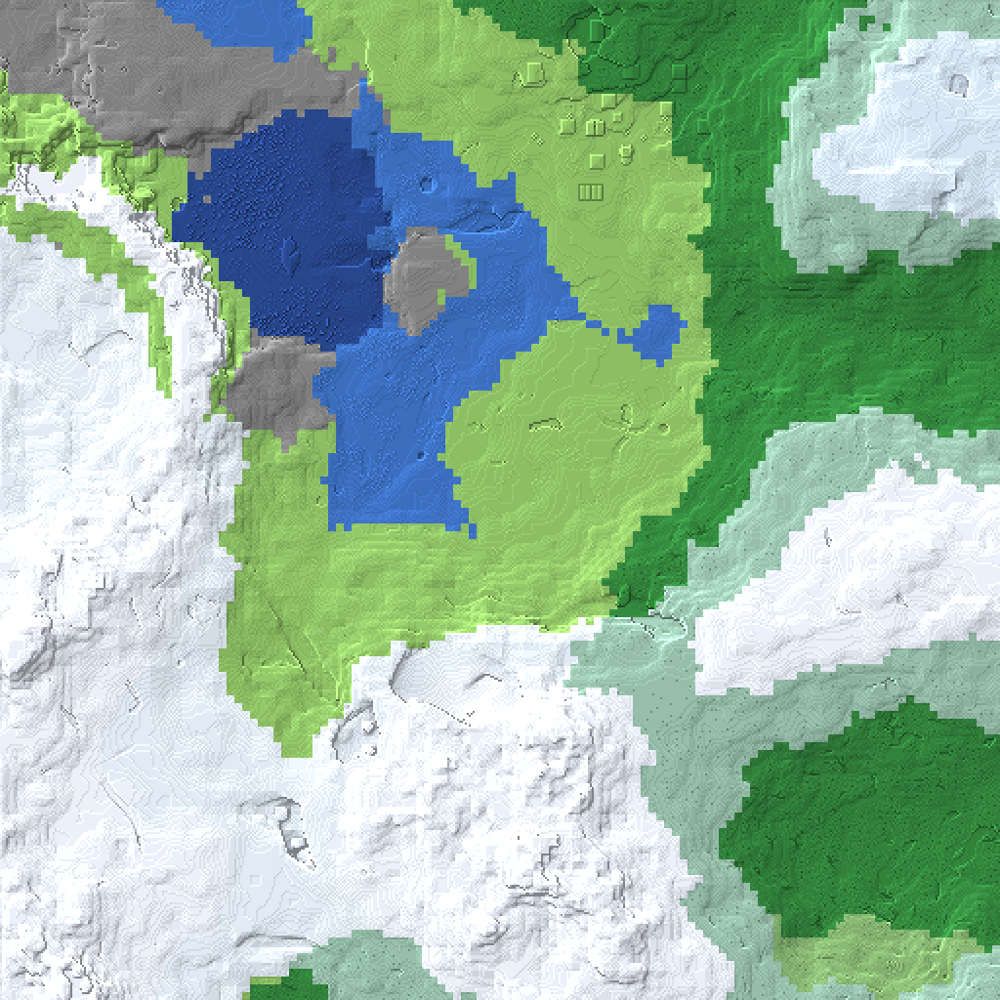
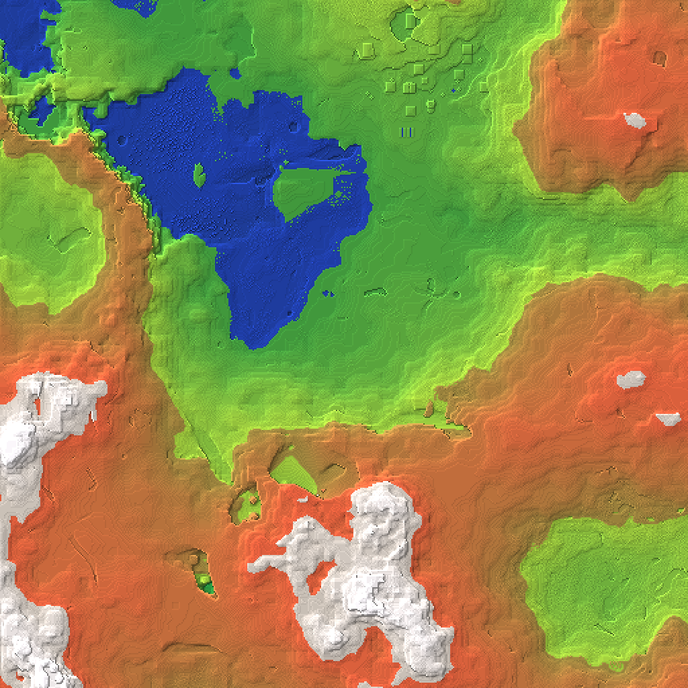
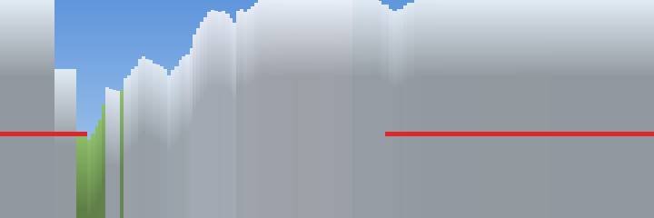
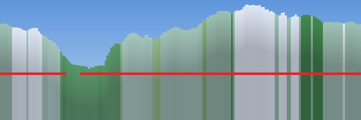
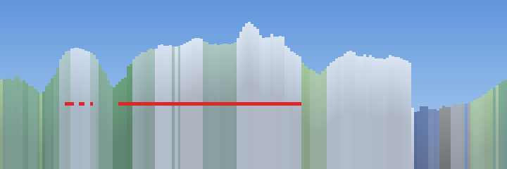

# Seed 434533485056755 (Java, 1.21.8)

Scouted 2026-09-16 against the same pipeline that picked seed 12345: Mojang's
1.21.8 server jar generating 512×512 blocks around the origin, `scan.mjs`
scoring every 128×128 window, `anvil.mjs` reading the region files back.
Scores here are directly comparable to the table in `docs/TERRAIN.md`.

**This is a scouting report. Nothing was swapped.** The Overworld is still the
generated superflat from `b5e2255`, `public/terrain/` was not touched, and
`island.js` still points where it pointed.

## Verdict first

**It does not beat 12345, and the gap is tree cover.** Best window here is
**85.6** against 12345's **97.3**. It would slot in second in the ten-seed
field, just ahead of the old runner-up at 84.1 — a competent seed, not a
winner, *by the scorer*.

But the scorer is measuring the wrong thing on this particular seed, and the
honest version of the verdict is two sentences long:

- **As a 128×128 patch to build an island on, it is worse than 12345.** Less
  forest, and its top-scoring window has the identical canopy problem that
  `docs/FUTURE.md` item 6 describes.
- **As a place to stand and look at, it is the best thing this pipeline has
  produced.** There is a viewpoint at (16, −56) with nine distinct biomes in
  genuine line of sight, open sky, six of eight compass directions clear for
  64+ blocks, and 164 blocks of visible relief. The scorer rates the windows
  around it **44 to 61**, because everything worth seeing is 100–200 blocks
  outside the box it measures.

If the island ever wants a horizon rather than a floor, that disagreement is
the interesting part of this seed. If it wants a dense walkable patch, 12345
is still the answer.

## Window scores

| corner | score | biomes | relief | trees | peak | biomes present |
|---|---|---|---|---|---|---|
| **96,112** | **85.6** | 4 | 69 | 3% | 187 | forest 61%, grove 26%, birch_forest 11%, jagged_peaks 2% |
| 80,96 | 85.3 | 4 | 76 | 3% | 202 | forest 50%, grove 41%, jagged_peaks 6%, birch_forest 2% |
| 96,128 | 85.3 | 4 | 73 | 3% | 187 | forest 55%, grove 25%, birch_forest 16%, jagged_peaks 5% |
| 80,112 | 85.2 | 4 | 80 | 3% | 202 | forest 50%, grove 32%, jagged_peaks 9%, birch_forest 9% |
| 80,128 | 84.8 | 4 | 87 | 2% | 202 | forest 46%, grove 29%, birch_forest 13%, jagged_peaks 13% |
| 64,112 | 84.3 | 4 | 91 | 2% | 235 | forest 40%, grove 34%, jagged_peaks 20%, birch_forest 7% |
| 64,128 | 84.0 | 4 | 95 | 2% | 235 | forest 37%, grove 29%, jagged_peaks 24%, birch_forest 9% |
| 96,−128 | 83.8 | 4 | 85 | 2% | 173 | forest 67%, grove 23%, plains 7%, jagged_peaks 3% |

For comparison: 12345 at (112, −32) scored 97.3 with 4 biomes, 112 relief and
**9%** trees; 8675309 at (0, 64) scored 84.1.

Every window here maxes the biome term (4 of 4) and all but one maxes the
relief term (60 is the cap; several clear 80). **The entire deficit is trees.**
Across the whole 512×512 survey only **0.6% of columns contain a log**, against
the 9% 12345's patch manages. The 20-point tree term is contributing 4–6 points
instead of 18. There is no window anywhere in this seed that can score above
about 86, because there is no forest dense enough to earn the rest.

Overall biome census across the survey: jagged_peaks 24.7%, plains 19.3%,
forest 15.6%, grove 11.2%, snowy_slopes 10.7%, river 6.0%, stony_shore 5.1%,
ocean 3.6%, frozen_peaks 2.6%, birch_forest 1.1%.

## What this seed actually is

A mountain seed. Ground height runs **26 to 255** — the highest column is
jagged peaks at (−244, 79) topping out at **y=255**, effectively the ceiling
terrain can reach. **15.8% of all columns sit above y=180**; 5,697 of them
above y=220. 12345's celebrated frozen peak reached 168.



*Biome map, 512×512 around the origin, north up, hillshaded. What it shows: two
enormous snow-and-rock masses (the near-white regions) filling the west and the
south-centre, with a third rising out of the east. Between them runs a
lowland corridor — the pale green plains through the middle and the deep blue
lake-and-river system at the top left of centre. The dark green in the east and
south-east is the forest/grove belt the top-scoring windows sit in. The magenta
you would see on an unknown biome does not appear, so every biome in frame is
one the palette knows.*



*Same area as elevation. Green is low, orange is high, white is above roughly
y=215. The read: this is not one mountain with a skirt, it is a ring of high
ground around a low basin. The orange mass wraps from the south-west round
through the south to the entire eastern edge, and the white caps inside it are
genuine peaks, not spires. The green throat running north-east from centre —
with the blue lake in it — is the only sustained flat ground, and it is where
the good viewpoints turn out to be.*

## Spawn: open sky, but standing in a cleft

World spawn is **(−48, 131, 80)** — on a **snow block at y=130 in
snowy_slopes**, high on a mountain flank.

It is the opposite of 12345's spawn in one respect and no better in another.
**Zero of 81 surrounding columns are roofed** and there is open sky overhead;
no canopy, none of the dark-oak problem. But the sight lines say it is standing
in a rock notch:

| dir | first eye-level obstruction | ground 80 blocks out |
|---|---|---|
| N | stone at 1 block | 63 |
| NE | clear past 64 | 81 |
| E | stone at 21 | 150 |
| SE | stone at 43 | 203 |
| S | stone at 41 | 187→204 |
| SW | stone at 3 | 154 |
| W | stone at 2 | 125 |
| NW | stone at 1 | 94 |

Four of eight directions are walled within three blocks. The obstruction is
**stone, not leaves** — which is the distinction a pure sight-distance metric
loses, so it is worth stating plainly: you are hemmed in by a mountain, not
blindfolded by a canopy. Biomes actually reachable by an unobstructed ray:
three (snowy_slopes, plains, jagged_peaks).



*360° skyline from spawn at eye height. North at the left edge, then east,
south, west. The horizon line sits 39% down; the red bar marks azimuths where
something opaque blocks the view within 16 blocks. What it shows: grey rock
filling almost the entire frame and climbing out the top of it. One narrow
wedge of blue sky just east of north and a sliver of green below it is the only
distance visible. The maximum skyline angle here is **76°** — that is not a
view of a mountain, that is the inside of a mountain. Spawn is a bad place to
put anything.*

## The scorer's best window is under a canopy — again

The top-scoring window is (96, 112). Its centre, (160, 176), is grass at y=100
in forest, **37 of 81 columns roofed**, and every compass direction is blocked
within 3 to 13 blocks:

```
N  leaf_litter at 4     NE leaf_litter at 10   E  birch_leaves at 3
SE birch_leaves at 4    S  oak_leaves at 13    SW leaf_litter at 4
W  leaf_litter at 3     NW dirt at 7
```

Meanwhile the ground 80 blocks away in those same directions is at y=157, 179,
181 — a 148-block rise the scorer credits to the window and the player cannot
see a metre of.



*Skyline from (160, 176), drawn the same way. The red bar runs essentially the
full 360°. The tall green-and-white profile above it is what is geometrically
there — forest shoulders and a snow peak south-east — and the red says you
cannot see any of it. **This is docs/FUTURE.md item 6 reproduced exactly on a
different seed**, which is the useful finding: the canopy failure was never
specific to 12345. The scorer rewards trees and rewards relief and has no term
for the fact that the first thing prevents seeing the second.*

## The good viewpoint, which the scorer rates 44–61

(16, −56): plains, ground **y=69**, open sky.

- Six of eight compass directions **clear past 64 blocks**; the two that are
  not (SE at 18, S at 21) are the foot of a slope, dirt rather than leaves.
- Mean unobstructed sight distance over 180 azimuths: **75 blocks**.
- **Nine distinct biomes in genuine line of sight**: plains, forest, grove,
  frozen_peaks, jagged_peaks, snowy_slopes, ocean, stony_shore, river.
- **164 blocks of relief visible**; skyline reaches 43° above the horizon.



*Skyline from (16, −56). What it shows, left to right from north: a low green
shoulder, then a broad snow-capped massif filling the whole eastern and
southern arc with a distinct summit dead centre (that is due south), a second
white range to the south-west, and at the right — west and north-west — a
short blue-grey band, which is ocean and stony shore at distance. The red bar
covers only the southern third, the slope foot. Roughly two-thirds of the
compass is open. This is a real vista: forest at the feet, snow peaks across
three quadrants, water behind.*

And the windows there, by the existing scorer:

| corner | score | biomes | relief | trees | contents |
|---|---|---|---|---|---|
| −32,−96 | 61.2 | 3 | 47 | 0% | plains 77%, river 19%, forest 4% |
| −48,−112 | 52.0 | 3 | 29 | 0% | plains 64%, river 32% |
| −32,−128 | 52.0 | 3 | 29 | 0% | plains 71%, river 27% |
| −48,−96 | 44.0 | 2 | 38 | 0% | plains 71%, river 27% |

Forty-four to sixty-one, for the best view in the seed. The scorer is not
wrong about what it measures — that ground genuinely is flat, treeless, and two
or three biomes — it is that **a window score is a property of a box and a view
is a property of a line of sight**, and on this seed they point in opposite
directions. 12345 hid that by having its mountain inside the box.

## Structures

Read off the chunk NBT's `structures.starts`, not guessed from biomes:

| structure | count in 512×512 | nearest starts |
|---|---|---|
| ancient_city | 3 | (112,112), (−304,112), (160,−368) |
| mineshaft | 8 | (−48,64), (−224,−112), (−96,−336), (272,−288) |
| ruined_portal_mountain | 2 | (32,176), (−416,224) |
| village_plains | 1 | (64,−192) |
| shipwreck | 1 | (−112,−144) |

Three ancient cities inside a 512-block square is unusual — the generator
spaces them widely — and **the nearest one is at (112, 112), directly beneath
the top-scoring window**. A mineshaft starts at (−48, 64), sixteen blocks from
world spawn. The plains village at (64, −192) is about 140 blocks north of the
good viewpoint, which is the only structure here a walkable island could
plausibly incorporate above ground.

## Two notes on the tooling

**The occlusion blind spot is confirmed structural, not a 12345 accident.** The
scorer's number-one window on a completely different seed is again a forest
interior with a view of nothing. Anything picked by window score should be
re-checked with a ray test before it is built on. `scripts/terrain/seed-view.mjs`
(added with this report) does that check and draws the skyline; it is
deliberately separate from `scan.mjs` so the published score table stays
comparable.

**The leaf skip works, with one gap.** `survey()` does exclude leaves from the
ground scan — `isLeaf` plus the `COVER` set, line 75 of `scan.mjs` — so the
"first solid block from the top is a leaf" bug is genuinely fixed for
`*_leaves`. But **`minecraft:leaf_litter` passes both filters**: `isLeaf`
matches on the substring `_leaves`, and `leaf_litter` does not contain it. It
is a 1.21.4+ ground carpet, and in a 70×60 sample of this seed's forest belt
**1,482 columns carry it**, every one of which is scored as ground one block
too high. The effect on `relief` is at most one block and it does not change
any conclusion above, which is why it was left alone rather than patched — a
fix would shift the published scores and break comparability with
`docs/TERRAIN.md`. Worth folding in the next time that table is regenerated.

## Cost

Generation took **53 seconds** (the jar and 1.21.8 were already cached) and
added **84 MB** to `.mcgen/`, taking it from 942 MB to 1.0 GB.

## Reproduce

```
node -e "import('./scripts/terrain/generate.mjs').then(m=>m.generateSeed('434533485056755',256))"
node scripts/terrain/seed-report.mjs 434533485056755 /tmp/seed-report
node scripts/terrain/seed-view.mjs  434533485056755 /tmp/seed-report 16 -56 -48 80 160 176
```

---

## Postscript: what was actually built from it

Written after the fact, because the section above opens "Nothing was swapped"
and that stopped being true an hour later.

**A 256×256 patch at corner (−112, 0), shipped as `public/terrain/mountains.bin`,
1,464KB gzipped, reachable with `/world mountains`.** The superflat is still
the world you boot into and the asset is fetched on first entry, so nobody
pays for it who does not ask.

**Size, measured rather than argued.** Full bedrock-to-peak vertical range, on
this seed:

| side | raw | gzipped |
|---|---|---|
| 128 | 642KB | 262KB |
| 192 | 1547KB | 638KB |
| **256** | **3436KB** | **1464KB** |
| 320 | 4720KB | 1970KB |
| 384 | 6954KB | 2944KB |
| 512 | 12746KB | 5459KB |

512 is the whole area this report surveyed, and it is 5.5MB. "All the cool
stuff" does not fit under any sane download; 256 is where the curve is still
worth paying. What is in: the entire south-centre massif with its y=254 peak
comfortably interior, the ancient city at (112,112), the mineshaft at
(−48,64), the ruined portal at (32,176). What is out: the y=255 peak in the
far west, the (16,−56) viewpoint this report recommends, the plains village,
two of the three ancient cities, and every scrap of ocean.

The single biggest lever is the vertical FLOOR, not the width: raising `yMin`
from −64 to 0 costs a third of the bytes and to 40 costs two thirds, because
the ore-speckled deepslate accounts for 14 of the 26 runs in an average
column. It was left at bedrock — a floor above bedrock is a floor that caves
open through, and the repairs both break the property that
`scripts/terrain/verify.mjs` compares the asset to the region files with no
special cases.

## The ray test is not sufficient either, and that is this report's error

This report's recommendation was (16, −56) on the strength of its viewpoint
score. Two things were wrong with picking a spawn that way, and the second
one invalidates the recommendation.

**`seed-view.mjs` scores the MEAN of 180 sight lines.** Its best column inside
the chosen patch was (−48, 48), a perfect 100.0 — open sky, eight biomes in
line of sight, 143 blocks of relief. The screenshot from it is a wall of dirt
two blocks from your face. Half a compass of near-wall is bought back by the
other half being 200 blocks clear, and the mean never notices.

**And noa draws 128 blocks.** `chunkAddDistance` is `[4, 3]` — four chunks of
32. The vista at (16, −56) looks at mountains 180 blocks away, and this engine
does not render them. **A viewpoint metric with no range limit is measuring a
world nobody is looking at.** That is the term both `scan.mjs` and
`seed-view.mjs` are missing, and it is a bigger blind spot than the canopy
one, because it is invisible in every panorama this report drew.

The spawn that shipped is **(−32, 116), a snow block on a jagged peak at
y=198**, found by asking for: no log within 24 blocks, nothing more than 3
blocks higher within 10, nothing more than 25 higher between 12 and 45, and
the largest possible rise between 50 and 110 — inside what gets drawn. It
answers +56 at 95 blocks with 83% of that ring at eye level or below. Then it
was screenshotted, because that is the only instrument here that is not a
model.

## `minecraft:leaf_litter`: still not patched, now on purpose twice

This report flagged it and left it, to keep `docs/TERRAIN.md`'s published
scores comparable. That argument still holds, and there is now a second one:
**nothing that shipped was chosen by a `scan.mjs` score.** The patch corner
came from a border-clipping search over the height map and the spawn came from
the range-limited search above. A one-block error in forest ground height
changes neither, and the spawn that was picked has no tree within 24 blocks of
it. Fix it the next time that table is regenerated, which is still the right
time.
