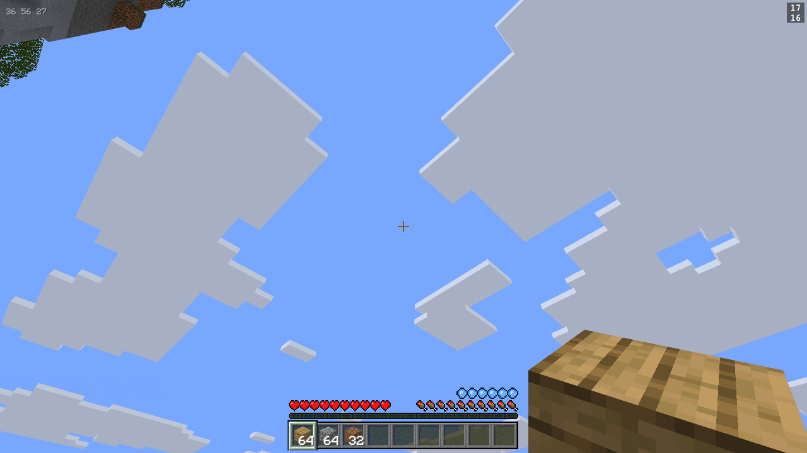
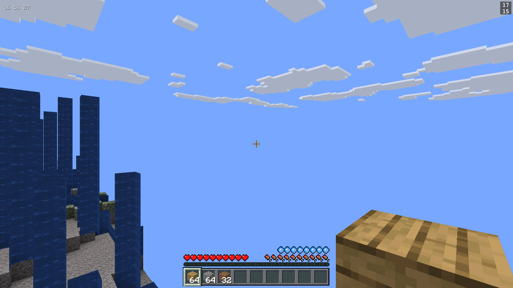
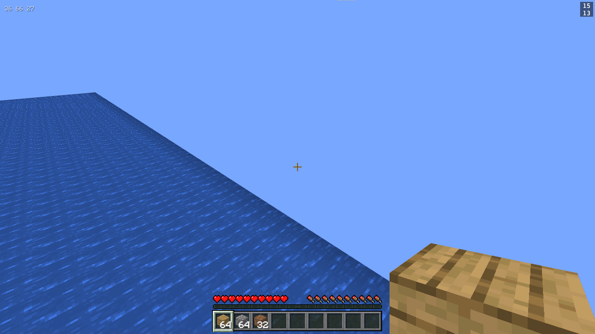
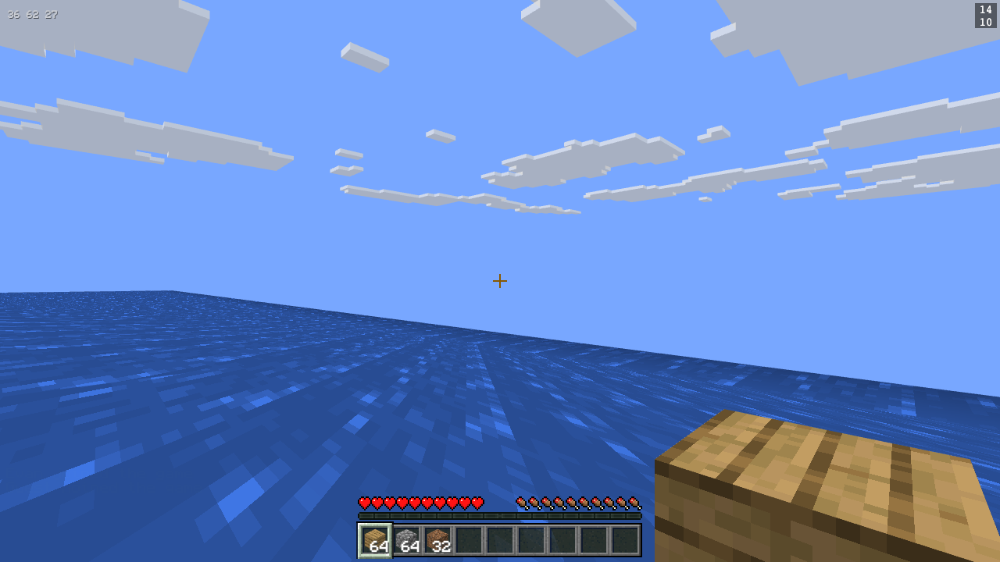

# Water

Research, diagnosis and a plan. No code was changed to produce this.

The physics of being in water already work and are documented in `src/fluids.js`
against Minecraft's real constants. This is about everything you can see and
hear, which is all of it still missing.

---

## 1. What is actually wrong

### Get in the water and look up

This is six blocks under the surface of the ocean in the imported patch, at sea
level, looking up. The air meter is draining, `game.fluids.eyes` reads
`'water'`, and the picture is of a sunny afternoon.



Clouds. Sky. Not one pixel of water between the camera and the horizon. That is
the owner's complaint in one frame, and it is worse than "looks transparent" --
water underneath you is not rendered at all.

Looking sideways from the same spot is the same story, plus a second bug:



The blue slabs on the left are the far edge of the ocean. The rest of the ocean,
the part between the camera and them, is invisible. That is not a tint problem,
it is the mesher: two adjacent water voxels share a face material, so noa's
greedy mesher draws nothing between them (`node_modules/noa-engine/src/lib/terrainMesher.js`).
A body of water is therefore a hollow shell, and once you are inside the shell
you see out through its far wall.

From above and at the surface the build is in much better shape than the report
suggests, and that is worth saying plainly:




The tint is right, the alpha is right, the terrain shows through. The surface is
one frozen frame of a 32-frame animation and it is dead still, but it is not
broken. **Everything that is badly wrong is below the waterline.**

To reproduce: the ocean is the large sea-level body in the imported 128x128
patch, surface at `y=62`, up to 27 blocks deep. Find it at runtime rather than
by coordinate -- the world's X axis is being unmirrored in a parallel change, so
any X written down today is wrong tomorrow. Scan for
`noa.getBlock(x, 62, z) === game.fluids.ids.water && noa.getBlock(x, 63, z) === 0`
after teleporting somewhere near sea level so the chunks are loaded. Teleport to
`x + 0.5, z + 0.5`; whole numbers land on a voxel boundary and float back to the
cell below.

### The five separate faults

1. **No underwater view treatment at all.** `grep -rn "fog" src/` returns
   nothing. `grep -rn "fog" node_modules/noa-engine/src/` also returns nothing.
   Neither this world nor the engine under it has ever set `scene.fogMode`.
2. **No underside.** The water surface is drawn single-sided, so from below
   there is nothing there.
3. **No interior.** Water-against-water faces are culled, so a lake is a shell.
4. **No animation.** `scripts/build-textures.mjs:353-366` crops every source PNG
   to its first square frame, on purpose, with the reason written in the comment:
   "noa's atlas has one layer per material and no notion of time."
5. **No sound.** `src/sounds.js:167` maps both fluids to `null` with the note
   "fluids have no SoundType", which is true of *block* sound types and is not
   the whole story. Nothing plays on entering, leaving, swimming in or being
   under water. `public/sounds/` has no water sample of any kind.

### The thing that makes this cheap

noa already ships the mechanism for the underwater overlay and it is switched
off by an accident of how this repo registers materials.
`node_modules/noa-engine/src/lib/rendering.js:412-431`:

```js
function checkCameraEffect(self, id) {
    if (id === self._camLocBlock) return
    if (id === 0) { self._camScreen.setEnabled(false) }
    else {
        var matData = self.noa.registry.getMaterialData(matId)
        var col = matData.color
        var alpha = matData.alpha
        if (col && alpha && alpha < 1) { ...enable a tinted full-screen plane... }
    }
    self._camLocBlock = id
}
```

There is a plane called `_camScreen`, parented to the camera at `z = 0.1`, sized
10, created at boot and disabled. It exists exactly to tint the view when the
camera is inside a translucent block, and the comment above it says so. It never
fires here because `blocks.js:registerBlocks` registers every material with
`{ textureURL, atlasIndex, texHasAlpha }` and never with `color` or `alpha`, so
`col` is `undefined` and the test fails silently. The engine has been trying to
draw the underwater overlay since the day water was added.

---

## 2. Vanilla's real behaviour, with numbers

All texture figures measured directly out of the 1.21.8 client jar on this
machine (`assets/minecraft/textures/block/`, `.../misc/`), not quoted.

### Textures

| File | Size | Frames | Alpha in file | Greyscale |
|---|---|---|---|---|
| `block/water_still.png` | 16x512 | 32 | 180 everywhere | yes |
| `block/water_flow.png` | 32x1024 | 32 | 180 | yes |
| `block/lava_still.png` | 16x320 | 20 | 255 | no |
| `block/fire_0.png` | 16x512 | 32 | 0 or 255 | no |
| `block/nether_portal.png` | 16x512 | 32 | 155-232 | no |
| `block/prismarine.png` | 16x64 | 4 | 255 | no |
| `block/sea_lantern.png` | 16x80 | 5 | 255 | no |
| `block/magma.png` | 16x48 | 3 | 255 | no |
| `misc/water_overlay.png` | 16x16 | 1 | 180 | yes |
| `misc/underwater.png` | 16x16 | 1 | 135 and 146 | **no** |

The `.mcmeta` files, verbatim:

* `water_still.png.mcmeta` -- `{"animation":{"frametime":2}}`. 32 frames, 2
  ticks each, so a 64-tick (3.2 second) loop, frames played 0..31 in order.
* `lava_still.png.mcmeta` -- `frametime: 2` with an explicit 38-entry frame
  list that runs 0..19 and then back down 18..1. A ping-pong, 76 ticks, 3.8s.
* `magma.png.mcmeta` -- `frametime: 8`, `interpolate: true`, frames `[0,1,2]`.
* `prismarine.png.mcmeta` -- `frametime: 300`, `interpolate: true`, and a
  hand-written 22-entry frame order. 6600 ticks is five and a half minutes per
  loop, which is why prismarine reads as breathing rather than as animating.
* `sea_lantern.png.mcmeta` -- `frametime: 5`, no frame list, so 0..4 in order.
* `fire_0.png.mcmeta` -- no frametime (default 1) and a frame list that is
  simply 16..31 then 0..15, i.e. a phase offset.
* `nether_portal.png.mcmeta` and `water_flow.png.mcmeta` -- `{"animation":{}}`,
  every default: frametime 1, frames in file order.

Default `frametime` is 1 tick when the key is absent. `interpolate: true` means
cross-fade between consecutive frames rather than cut.

The `water_overlay.png` / `underwater.png` distinction matters and is easy to
get backwards. `water_overlay.png` is a *block* texture, drawn on the face of a
solid block that sits behind water, to stop water looking like a window onto
bare stone. `misc/underwater.png` is the 16x16 tile Minecraft tiles across the
whole screen when the camera is submerged -- that is the one that goes over the
camera. It is the only one of the two that is not greyscale, because it is not
tinted at runtime.

### Colour and alpha

* Water's default biome tint is `#3F76E4`. Swamp `#617B64`, lukewarm ocean
  `#45ADF2`, warm ocean `#43D5EE`, cold ocean `#3D57D6`, frozen ocean `#3938C9`.
  Nothing here knows about biomes, so `#3F76E4` is the whole story.
  (source: `https://minecraft.wiki/w/Water`)
* Alpha 180/255 = 0.706, baked into the greyscale PNG rather than applied at
  runtime.

### Fog

From `https://minecraft.wiki/w/Fog`:

* Water fog colour varies by biome; the tint colour is reused as the fog colour.
  `#3F76E4` for the default overworld.
* **Two fogs, blended.** When the camera descends into water a much thicker
  initial fog is applied, same colour, "obscuring the distance at 0.01 blocks",
  blended 25% with the normal water fog at the moment of entry. That transition
  fog fades: blended 60% at 5 seconds, gone at 30 seconds. So visibility
  *improves* as your eyes adjust. This is a real, feelable effect and it is the
  single most characteristic thing about going underwater in Minecraft.
* Respiration and Water Breathing stopped affecting water fog in 1.13. Night
  Vision and Conduit Power still clear it. None of those exist here.
* Lava fog is `#991A00` at roughly one block of visibility.
* Powder snow fog is `#9FBBC8` at two blocks.

The wiki does not publish the steady-state water fog distance as a number
because it is biome-driven and render-distance-relative. Treat the fog end as
"a handful of blocks" and tune by eye against a vanilla screenshot; the
transition behaviour above is the part worth reproducing exactly.

### Sounds

Every sound this needs is already on this machine, in the vanilla asset index at
`~/Library/Application Support/minecraft/assets/indexes/26.json`:

| Event | Assets | Vanilla volume |
|---|---|---|
| `ambient.underwater.loop` | `ambient/underwater/underwater_ambience.ogg` | 0.65 |
| `ambient.underwater.enter` | `ambient/underwater/enter1-3.ogg` | 0.5 |
| `ambient.underwater.exit` | `ambient/underwater/exit1-3.ogg` | 0.3 |
| `ambient.underwater.loop.additions` | `ambient/underwater/additions/*` (21 files: bubbles, crackles, dark, driplets, whale, water) | varies |
| `entity.generic.splash` | `liquid/splash.ogg`, `liquid/splash2.ogg` | |
| `entity.player.splash.high_speed` | `liquid/heavy_splash.ogg` | |
| `entity.generic.swim` | `liquid/swim1-18.ogg` | |
| `block.water.ambient` | `liquid/water.ogg` | 0.75-1.0, pitch 0.5-1.5 |
| `block.lava.ambient` | `liquid/lava.ogg` | |
| `block.lava.pop` | `liquid/lavapop.ogg` | |
| `entity.player.breath` (bubble pop) | `ui/hud/hud_bubble.ogg` | |

`liquid/*` is the original flat asset layout, the same one
`scripts/build-sounds.mjs`'s `SETS` table already uses for `damage/hit1` and
`random/pop`. Adding these is adding rows to that table, not teaching the script
a new shape.

---

## 3. Can this engine animate a texture

Short answer: yes, cheaply, and it is worth doing. The structural claim in the
build script's comment -- "noa's atlas has one layer per material and no notion
of time" -- is true of the atlas as built and not true of the hardware under it.

### How the atlas actually works

`scripts/build-textures.mjs:517-527` concatenates each page's 16x16 tiles into
one vertical strip PNG. noa's `TerrainMaterialPlugin`
(`node_modules/noa-engine/src/lib/terrainMaterials.js:184-263`) reads that PNG
back with `_readPixelsSync()`, infers `numLayers = height / width`, and builds a
`RawTexture2DArray`. Its fragment shader replaces Babylon's diffuse fetch with:

```glsl
baseColor = texture(atlasTexture, vec3(vDiffuseUV, texAtlasIndex));
```

`texAtlasIndex` is a **varying**, fed from a per-vertex attribute
`texAtlasIndices` that `terrainMesher.js:679-708` writes at mesh time.

That last fact kills the obvious approach. **Changing a material's `atlasIndex`
on the registry at runtime does nothing**, because the index is baked into every
chunk's vertex buffer when the chunk is meshed. You would have to re-mesh every
chunk containing water, sixteen times a second. Not viable. Rule it out and move
on.

### The three real options

**A. One layer per frame, cycle by re-meshing.** Rejected, above.

**B. Rewrite the layer's pixels every frame.** `RawTexture2DArray` exposes
`update(data: ArrayBufferView)` which replaces the *entire* array. The alpha page
is 31 layers of 16x16x4 = 31,744 bytes today, so a full re-upload is small in
bytes but is a full texture re-allocation path 15 times a second, and it would
force a re-upload of 30 unrelated static materials to animate one. Babylon 6 has
no public per-layer partial update for `RawTexture2DArray`. Workable, ugly,
wasteful.

**C. A layer-remap uniform in the shader.** This is the right one.

Put every frame of every animated texture in the atlas as its own layer, keep
the *logical* layer a material was assigned at mesh time, and add one indirection
in the fragment shader:

```glsl
// uAnimFrom / uAnimTo: small uniform arrays, or a 1xN lookup texture
float layer = texAtlasIndex;
layer = remap(layer);              // identity for every static material
baseColor = texture(atlasTexture, vec3(vDiffuseUV, layer));
```

Per tick, JS writes one integer per animated material into the remap table. No
mesh rebuild, no texture upload, one small uniform per frame. Every animated
texture in the game costs the same as one.

Implementation shape: a second `MaterialPluginBase` layered onto the same
material noa built, or a fork of noa's plugin. noa's plugin uses priority 200
and a regex-replacement of the same `baseColor=texture2D(...)` line, so a second
plugin cannot target that line again -- it has already been rewritten. The
honest version is to copy `TerrainMaterialPlugin` into `src/` with the remap
added and register it via `noa.registry.registerMaterial(..., { renderMat })`,
which `terrainMaterials.js:134` honours by returning the custom material
untouched. That is the supported escape hatch and it is one line of noa API.

### What it costs in atlas space

Today, from `blocks.js`:

```
atlas0..2  128 layers each, opaque
atlas3      14 layers,      opaque    -> 114 slots free
atlas4      31 layers,      alpha     ->  97 slots free
```

Water needs 32 layers and is already on the alpha page (atlas4), which has 97
free. Lava 20, sea lantern 5, prismarine 4, magma 3, fire 32, portal 32 are all
opaque and would land on atlas3, which has 114 free. **Every animated texture in
Minecraft fits in the atlas this build already produces, with room to spare, and
no new page.** That is the argument that turns this from an engine project into
an afternoon.

The cost that is real: `_readPixelsSync()` on a taller atlas PNG at boot, and
`ATLAS_PAGE_SIZE = 128` becomes a genuine constraint rather than a comfortable
one. If animated textures ever exceed the free slots, give them a dedicated page
and the remap table gets smaller, not bigger.

### What it unlocks

Water, lava, fire, nether portal, prismarine, prismarine bricks, dark
prismarine, sea lantern, magma block. Nine textures, six of which are in the
block palette today and are currently rendering as a frozen first frame that
nobody has noticed because nobody has stood in front of a sea lantern and
waited.

---

## 4. The plan, in order

Each step is independently shippable and each one is visible. Do them in this
order; step 1 is the owner's actual complaint and the other four are polish on
top of it.

### Step 1 -- The underwater view. `src/underwater.js` (new), `src/main.js`

No dependencies. This is the whole of the reported bug and it is the cheapest
thing here.

* Read `fluids.eyes` (already exposed, `src/fluids.js`) each tick.
* **Fog.** `scene.fogMode = Scene.FOGMODE_EXP2`, `scene.fogColor` from the
  water tint, `scene.fogDensity` ramping from very dense at the moment of entry
  down to the steady value over 30 seconds, with the 5-second/60% waypoint from
  the wiki. Restore `FOGMODE_NONE` on exit.
* **Overlay.** A camera-parented plane carrying `misc/underwater.png` tiled,
  scrolling slowly with camera yaw the way vanilla's does. Build your own plane
  rather than borrowing `noa.rendering._camScreen` (see Risks).
* Do **not** touch `src/sky.js`. It is another agent's file this pass and it
  does not currently own fog -- there is nothing to merge with.

`scripts/build-textures.mjs` needs one extra extraction for
`misc/underwater.png` and `misc/water_overlay.png`. That file is also held by
another agent this pass; it already extracts from `assets/minecraft/textures/misc/*`
for the sun and moon, so this is a name added to an existing list.

### Step 2 -- The surface from below. `src/blocks.js`

Independent of step 1, same afternoon.

Water's top face needs to be visible from underneath. Two candidate mechanisms,
and the right one has to be established by experiment rather than by reading:

* `backFaceCulling = false` on the water material, which makes the existing
  single-sided quad visible from both sides for free. Cheapest if it works.
* A `blockMesh` for water, the way `blockMeshes.js` does slabs. Much more
  expensive and it takes water off the terrain mesher, which is a real loss.

Try the first. The interior-culling problem (water-against-water faces being
dropped) is separate and is *correct* behaviour -- vanilla culls those too. What
vanilla does differently is have fog, which is why you never notice. Once step 1
lands, step 2's remaining job is just the surface plane over your head.

### Step 3 -- Sounds. `scripts/build-sounds.mjs`, `src/sounds.js`, `src/main.js`

Depends on nothing. Can be done in parallel with 1 and 2 by a different person.

* Add to `SETS` in `build-sounds.mjs`: `underwaterLoop`, `underwaterEnter`,
  `underwaterExit`, `splash`, `splashHigh`, `swim`, `waterAmbient`,
  `lavaAmbient`, `lavaPop`, from the asset paths in section 2. All exist locally.
* Wire in `sounds.js`: `play(event, group, worldPos)` already takes a world
  position, so the one-shots can be positional. The ambient loop should be flat
  (it is an ear-state, not a thing in the world).
* The loop wants the pattern in `src/rainAudio.js` -- hang off the AudioContext
  `sounds.js` creates on first gesture, never make a second one, ramp gain
  rather than snapping. Read that file's header before writing this; it has
  already solved the same problem.
* **The free set.** `npm run build:deploy` runs `sounds:free`, and
  `sounds-src/free/` has no water sample at all. Today a deploy would be silent
  under water, which is no worse than now but is a regression against the
  vanilla build. Two honest options: find CC0/CC-BY water samples and add them
  to `FREE` with a `NOTICE.txt` entry, or synthesise the underwater loop the way
  `rainAudio.js` synthesises rain -- a low-passed noise bed is an extremely good
  approximation of being underwater, arguably better than it is of rain. Prefer
  the synthesis. Do not ship an unattributed sample.

### Step 4 -- Bubble particles. `src/particles.js`

Depends on step 1 only in the sense that bubbles are invisible without fog to
see them against.

`particles.js` is already a pooled-quad system keyed by block texture with an
`emit(blockId, x, y, z, vx, vy, vz, life, size)` primitive. Bubbles need a
texture that is not a block texture, so `systemFor()` grows a second path keyed
by an arbitrary sprite name. Vanilla's bubble is
`assets/minecraft/textures/particle/bubble.png`, a 2-frame 8x8 strip; the
particle atlas is not currently extracted at all, so `build-textures.mjs` gains
a `particle/` pass.

Behaviour: a bubble every few ticks while swimming, drifting up at a shade under
the swim-climb speed, deleted on reaching air. Vanilla also spawns a burst at
the moment of entry, which is the same `burst()` shape the break effect uses.

### Step 5 -- Animated textures. `scripts/build-textures.mjs`, `src/blocks.js`, `src/terrainAnim.js` (new)

The big one, and it is last for a reason: it is the only step that touches the
render path, and steps 1-4 make water look and feel right without it.

1. `blocks.js` gains `frames` / `frametime` / `frameOrder` metadata per material,
   read from the `.mcmeta` at build time rather than hand-copied, and the atlas
   page allocator reserves `frames` consecutive slots instead of one.
2. `build-textures.mjs` stops cropping animated sources to frame 0 and emits
   every frame as its own layer. The per-material `<name>.png` for
   `blockIcon.js` keeps being frame 0 -- inventory icons should not animate.
3. `src/terrainAnim.js` owns the copied-and-extended material plugin and a tick
   loop that writes the remap table. Frame timing in *Minecraft ticks*, not
   seconds, so the numbers in the `.mcmeta` go in unconverted.
4. `interpolate: true` (magma, prismarine) is a second sample and a mix in the
   shader. Ship without it first; it affects two blocks and nobody will notice.

---

## 5. What I would not build

**Flowing water.** `water_flow.png` exists, is 32x1024, and is a different
texture applied to the sides of non-full water blocks with a directional UV
rotation. There are no fluid levels here -- every water voxel in the imported
patch is a full still block, and `fluids.js` says so explicitly. Flow would mean
fluid levels, which means fluid simulation, which is a different project.

**Biome water colours.** Six hex values and no biome data. `#3F76E4` everywhere.

**The `water_overlay.png` block texture.** It only matters where a solid block
sits behind water and you are looking through the water at it. With step 1's fog
in place you cannot see far enough for it to come up.

**Screen distortion / wobble.** Vanilla does not do this either. Resist.

**A GPU water shader with real waves.** Wrong world. The whole look here is
16x16 pixels and a greedy mesher.

### If step 5 does not happen

Say so up front rather than leaving water in a half-state. A good non-animated
water is:

* Frame 0 of `water_still.png`, tinted `#3F76E4` at alpha 180 -- which is
  exactly what ships today and looks fine from above.
* Fog, overlay, sound and bubbles from steps 1-4.

That version is 90% of the felt improvement. Animation is the part you notice in
a screenshot; fog is the part you notice while playing. If only one gets built,
build the fog.

---

## 6. Risks and traps

**Babylon freezes the terrain materials, and a frozen material never learns
about fog.** `terrainMaterials.js:157` and `:176` call `mat.freeze()`. Babylon's
`freeze()` sets `checkReadyOnlyOnce`, so `isReadyForSubMesh` returns early and
`prepareDefines` never runs again. Setting `scene.fogMode` *after* the terrain
materials exist marks all materials dirty, but frozen ones ignore it -- the
`FOG` shader define is never added and **the fog silently does nothing on
terrain while working perfectly on every unfrozen mesh in the scene**. The
symptom is fog that affects clouds, the sun and item entities but not the world,
which reads as a Babylon bug and is not one. Either set `scene.fogMode` before
the first chunk meshes, or call `unfreeze()` / `markAsDirty(Material.MiscDirtyFlag)`
/ `freeze()` on each terrain material after changing it. Test this first, before
writing anything else in step 1.

**`noa.rendering._camScreen` will fight you.** It is a private field, it is
already parented to the camera, and `checkCameraEffect` runs on every render and
calls `setEnabled(false)` whenever the camera's block id is 0. If you enable it
yourself while submerged it survives (the function early-returns while the id is
unchanged), but the moment you surface noa disables it -- which happens to be
right -- and the moment a chunk pops in and the id read flickers, it is not.
Build a separate plane. The engine's version also uses `ambientColor` on a
frozen `StandardMaterial` with no texture, which cannot carry
`misc/underwater.png` anyway.

**Alpha sorting.** The water material is already on the alpha atlas page
(atlas4) and already goes through Babylon's transparent pass. Adding a
camera-parented overlay plane at `z = 0.1` puts a second transparent surface in
the scene that must draw *after* everything. Set `renderingGroupId` on it, or
`alphaIndex`, and do not rely on distance sorting -- it is parented to the
camera, so its distance is constant and the sort is a coin flip. The existing
`preview-clouds-under.png` shows clouds already sit in that pass; check the
overlay draws over them.

**The atlas index is per-vertex, not per-material.** Written out in section 3
but worth repeating here because it is the single assumption that would waste a
day. `noa.registry.registerMaterial(name, { atlasIndex })` at runtime changes
nothing already meshed.

**`_readPixelsSync()` at boot.** noa reads the atlas PNG back off the GPU
synchronously to build the array texture. A taller atlas makes that stall longer
on the main thread during load. Measure it before and after step 5.

**Do not put fog in `src/sky.js`.** It already drives `scene.clearColor`,
`scene.ambientColor` and the directional light off the day/night clock, and
vanilla's underwater fog colour is *not* driven by time of day -- it is the
water colour, flat. Two writers to scene-level state on the same tick is the bug
you find three weeks later when sunset turns the ocean orange. Keep the water
fog in its own module, have it save and restore whatever it overwrites, and have
it be the only thing that touches `scene.fog*`.

**`fluids.eyes` is the right signal and `fluids.feet` is not.** Already
separated in `fluids.js` for exactly this reason: chest-deep in a pond you are
slowed but you are not underwater. Fog and overlay follow the eyes. The splash
one-shot follows the feet.

**`.source` markers.** `public/textures/.source` and `public/sounds/.source`
both read `vanilla`. Anything in step 3 or step 5 that runs a build script must
not switch them. `npm run textures` and `npm run sounds` with no `--source`
rebuild whatever is already installed, which is what you want; `textures:ce` and
`sounds:free` are not.

---

## What shipped

Steps 1-3. Steps 4 (bubbles) and 5 (animated textures) are still open, and
this document's own judgement stands: fog is the part you notice while
playing, and it is in.

* **Step 1.** `src/underwater.js`, wired from `src/main.js`. EXP2 fog in
  `#3F76E4`, thick on entry and thinning to steady over thirty seconds on the
  wiki's 25%/60%/100% blend, plus a camera-parented overlay at
  `renderingGroupId = 2` (above heldItem.js's group 1) carrying a generated
  murk tile that scrolls with yaw and pitch.
* **The freeze trap is real and it bit.** `scene.fogMode` is set once at
  install and never changed; `fogDensity` is the switch, and density 0 is
  exactly no fog. Flipping the MODE off on exit is a second trap this document
  does not name: Babylon only binds the fog uniforms while
  `fogMode !== NONE`, so the shader would keep the last density it was handed.
  `test/28-underwater.spec.js` asserts `#define FOG` on every terrain
  material, and reintroducing the bug leaves the flag, the density AND the
  pixel check all passing -- it is the only assertion that catches it.
* **`_camScreen` was not borrowed**, for the reasons in section 6 plus one
  more: `checkCameraEffect` re-gates on the LIVE voxel id every render, so it
  blinks off whenever a chunk has not finished loading. `fluids.eyes` is
  already the correct signal.
* **The overlay texture is generated, not extracted.** `misc/underwater.png`
  would have meant editing `build-textures.mjs`, and Pixel Perfection CE has
  no such file anyway -- a generated tile is the only version of this that
  survives `build:deploy`.
* **Step 2** is `backFaceCulling = false` on the alpha atlas page, set from
  Babylon's `onNewMaterialAddedObservable` because noa builds terrain
  materials lazily and freezes each one on the spot. It is the whole page, so
  leaves and glass draw their far faces too.
* **Step 3** added ten `SETS` rows and the wiring. The free/CE bed is
  synthesised -- white noise through a 260 Hz lowpass -- rather than shipping
  an unattributed sample; the one-shots are simply absent there.
* **The entry fog is not the wiki's literal 0.01 blocks.** That is total
  blindness for the first seconds of every dive. The shape is reproduced, the
  extreme is not.

`test/12-sounds.spec.js:79` asserts the manifest carries exactly five sets and
now sees fifteen. Left red on purpose -- it is not this change's spec to edit.
